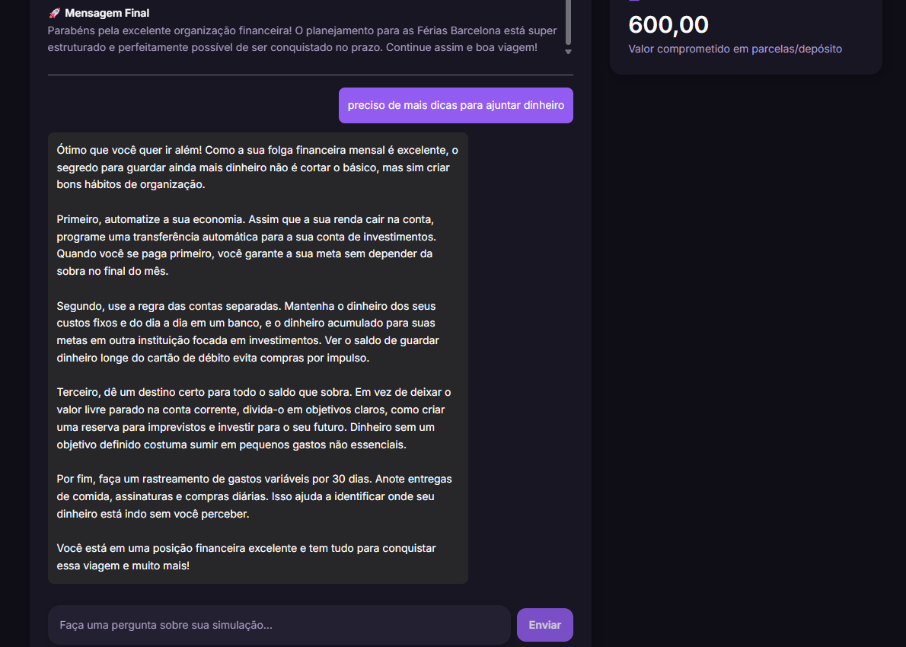
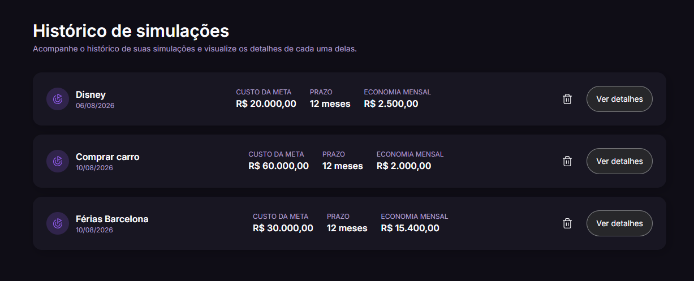

# 💰 Planej.ai

## Sobre o projeto

Sobre o projeto

O Planej.ai é uma aplicação web desenvolvida para auxiliar no planejamento financeiro pessoal por meio de simulações financeiras e recursos de Inteligência Artificial Generativa.

A aplicação permite que o usuário informe dados como renda, custos fixos, dívidas, objetivo financeiro e prazo, utilizando essas informações para calcular a viabilidade da meta.

A partir dos dados da simulação, a aplicação utiliza a API do Google Gemini para gerar um diagnóstico personalizado, apresentando sugestões práticas relacionadas à organização financeira, economia, geração de renda e planejamento.

Além do diagnóstico, o Planej.ai também possui um chat de acompanhamento com IA, permitindo que o usuário tire dúvidas e converse sobre os resultados obtidos na simulação.

O projeto foi desenvolvido como parte de um desafio de programação aplicada, dividido em etapas de desenvolvimento, incluindo a implementação do histórico de simulações e posteriormente a funcionalidade de interação com IA.

## Objetivo

O principal objetivo do Planej.ai é tornar o planejamento financeiro mais simples, acessível e personalizado.

A proposta é utilizar tecnologia para transformar números e informações financeiras em recomendações que possam ser compreendidas e utilizadas pelo usuário no seu planejamento.

O projeto busca:
  - Facilitar a análise da situação financeira;
  - Avaliar a viabilidade de metas;
  - Utilizar IA para gerar recomendações personalizadas;
  - Apresentar sugestões práticas;
  - Permitir acompanhamento através de um chat com IA;
  - Facilitar a consulta de simulações anteriores.

## Demonstração

       
    

## Funcionalidades

- [x] Simulação guiada por formulário em etapas (renda, custos fixos, dívidas, meta e prazo)
- [x] Máscara automática de valores em reais
- [x] Cálculo de viabilidade da meta com base no saldo mensal disponível
- [x] Diagnóstico financeiro personalizado gerado por IA (Gemini)
- [x] Sugestões de economia, renda extra e investimentos
- [x] Chat de acompanhamento com contexto da simulação
- [x] Histórico de simulações, com consulta e exclusão
- [x] Tema claro/escuro com persistência de preferência

## Tecnologias utilizadas

O projeto foi desenvolvido com as seguintes tecnologias:

- **[React 19](https://react.dev/)** — biblioteca para construção da interface
- **[TypeScript](https://www.typescriptlang.org/)** — tipagem estática
- **[Vite](https://vitejs.dev/)** — bundler e servidor de desenvolvimento
- **[React Router](https://reactrouter.com/)** — roteamento entre páginas
- **[Tailwind CSS](https://tailwindcss.com/)** — estilização utilitária
- **[Lucide React](https://lucide.dev/)** — ícones
- **[React Loading Skeleton](https://www.npmjs.com/package/react-loading-skeleton)** — estados de carregamento
- **[Google Gemini API](https://ai.google.dev/)** — geração do diagnóstico financeiro e das respostas do chat
- **[Oxlint](https://oxc.rs/)** — lint

## Pré-requisitos

Antes de começar, você vai precisar ter instalado em sua máquina:

- [Git](https://git-scm.com/)
- [Node.js](https://nodejs.org/) (versão 18 ou superior)
- Um gerenciador de pacotes ([npm](https://www.npmjs.com/), já incluso no Node.js)
- Uma chave de API do [Google AI Studio](https://aistudio.google.com/) (Gemini)

## Instalação

# Clone este repositório
git clone https://github.com/claudiaassiss/planejai.git

# Acesse a pasta do projeto
cd planejai

# Instale as dependências
npm install

## Estrutura de pastas

src/
├── components/
│   ├── features/          # Componentes específicos de cada funcionalidade
│   │   ├── Simulation/         # Formulário de simulação (etapas, hero, progresso)
│   │   ├── SimulationResults/  # Cards de resultado e histórico
│   │   └── Insights/           # Exibição do diagnóstico de IA
│   ├── layout/             # Layout raiz e cabeçalho
│   └── shared/              # Componentes reutilizáveis (Button, Input, Divider...)
├── context/theme/          # Contexto de tema claro/escuro
├── data/                    # Etapas do formulário e construção dos prompts de IA
├── hooks/                   # Hooks customizados (simulação, insight, conversa, tema)
├── pages/                   # Páginas da aplicação
├── services/                # Integração com a API do Gemini
├── utils/                    # Funções utilitárias (moeda, cálculos financeiros)
└── router.tsx                # Definição das rotas

 